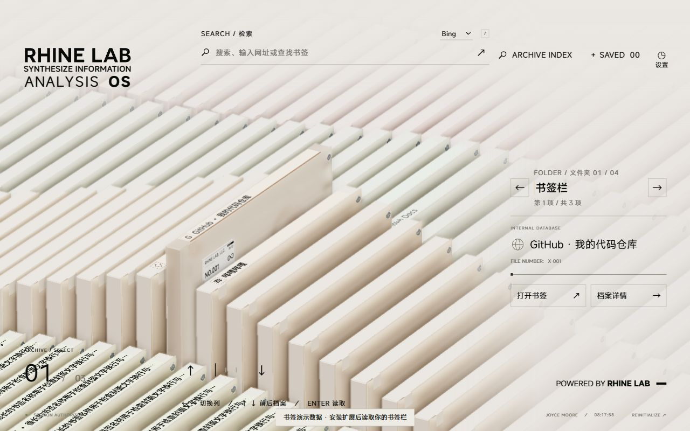

# Rhine Lab · 莱茵生命起始页

把浏览器书签栏变成可交互的三维档案阵列。基于 [LBEILC/RhineLabUI](https://github.com/LBEILC/RhineLabUI) 改造，保留莱茵生命终端的玻璃档案、开场动画与声音，作为 Chrome / Edge 的新标签页使用。

**当前扩展版本：0.8.2** · [安装与详细说明](docs/EXTENSION.md) · [上游更新评估](docs/UPSTREAM-REVIEW-2026-09-21.md)



*图为 0.8.2 演示数据预览，图标为占位。实际安装后读取你自己的书签栏。*

## 功能

- **书签变成档案**：书签栏根部的书签组成第一列；每个顶层文件夹各占一列，嵌套文件夹中的书签归入所属顶层列。左右切文件夹、上下选书签，支持循环浏览和各列选档记忆。
- **顶部书脊标记**：显示网站 Logo 和浏览器保存的书签名称，可分别开关；空名称保持为空。不同文件夹用淡色区分，选中档案抬起并带有下沿细线，正面保留原有莱茵标签。
- **保留导航页**：打开书签和搜索结果默认新建标签页，也可在设置中改为覆盖当前页。
- **网络与书签搜索**：顶部搜索栏可输入关键词或网址，同时显示本地书签匹配；支持 Bing、Google、百度，另有完整档案索引。
- **三种启动方式**：完整动画、简短动画后就绪即进入、直接进入三维档案。前段动画期间预加载模型与渲染资源，资源未就绪时继续等待。
- **清晰度与配色**：亮色 / 暗色、清晰画质、性能画质及精细设置；书脊采用独立屏幕分辨率渲染层。减少动态效果与超级性能模式独立控制。
- **档案详情与 360° 查看器**：双击选中档案可查看详情，并进入模型旋转、缩放、拆解和重组。

## 安装

面向支持 Manifest V3 的桌面 Chromium 浏览器，主要在 Chrome / Edge 验证。需要 WebGL 2。当前安装方式为加载已解压扩展。

### 从源码构建

安装 **Node.js 24**，执行：

```sh
git clone https://github.com/Acew-zl/RhineLabUI.git
cd RhineLabUI
npm ci
npm run build:extension
```

1. Chrome 打开 `chrome://extensions`，或 Edge 打开 `edge://extensions`。
2. 打开「开发者模式」，点击「加载已解压的扩展程序」。
3. 选择项目中的 **`release/extension`**，即包含 `manifest.json` 的文件夹。
4. 新建标签页；若浏览器提示是否保留新标签页扩展，选择保留。

如果拿到的是已构建的扩展 ZIP，解压后从第 1 步开始即可。GitHub 的 **Code → Download ZIP** 是源码，需要先构建。安装后的日常使用不需要 Node.js、终端或本地服务器。

### 更新

更新源码后重新执行 `npm run build:extension`，在扩展管理页点击「重新加载」，然后新建标签页。已经打开的导航页不会自动替换代码。

若安装的是其他目录中的解压包，请先用新版内容替换那个目录。保留同一扩展安装与浏览器配置可沿用偏好；无需卸载重装。移除或禁用扩展即可恢复原新标签页。

扩展替换的是**新标签页**；浏览器启动时打开哪一页，仍由浏览器自身的启动设置决定。

## 操作

| 操作 | 效果 |
| --- | --- |
| 左右按钮 / `←` `→` | 切换书签文件夹，保留各列选档记忆 |
| 上下按钮 / `↑` `↓` / 滚轮 | 切换当前列的书签 |
| 拖动档案阵列 | 沿画面中的阵列方向浏览，支持惯性 |
| 单击档案 | 选中书签 |
| `Enter` /「打开书签」 | 打开选中书签，默认新标签页 |
| 双击已选中档案 /「档案详情」 | 查看档案详情 |
| `/` | 阵列页聚焦顶部搜索；详情页打开档案索引 |
| `ARCHIVE INDEX` | 打开完整档案索引 |
| `Esc` | 收起搜索、关闭弹窗或返回阵列 |

搜索框内上下键选择书签匹配，Enter 打开所选匹配；未选择匹配时，Enter 提交网络搜索或打开输入的网址。中文输入法组词期间不会提交。

## 设置与书签同步

设置按「浏览与搜索」「书签显示」「启动与动效」「画面与性能」「声音」分组。可分别设置书脊 Logo、书脊名称、右侧名称旁 Logo、链接打开方式、启动方式、音效和配乐，偏好在本地保存。

这里的“备注”就是浏览器里的**书签名称**，不是另行生成的描述。没有名称的书签在书脊上仅显示 Logo，右侧正文和搜索结果用网址补充识别。Logo 优先读取浏览器缓存；缓存缺失时可能显示首字或通用图标，可在设置中查看状态并重试。

在浏览器书签栏中编辑、移动或删除书签后，当前导航页会提示「刷新书签」，新开的标签页直接读取最新内容。扩展本身不会修改你的书签。

“清晰 · 屏幕适配”按实际屏幕密度渲染并关闭景深虚化，仍受 GPU 和像素上限约束。旧默认画质首次升级会迁移，已自定义的画质保持不变。设备负载较高时可以选择性能档或超级性能模式；这与是否保留动画分别设置。

隐私处理详情见 [隐私政策](PRIVACY.md)。商店发布进度与提交材料见 [store/README.md](store/README.md)；当前尚无商店安装链接。

## 本地资源与权限

模型、MiSans 字体、音频和界面资源随扩展打包，打开导航页不依赖在线 CDN 或后端服务。访问书签网站、提交网络搜索仍需要相应的网络连接。

仅申请以下浏览器权限：

| 权限 | 用途 |
| --- | --- |
| `bookmarks` | 读取书签树，监听书签变化 |
| `favicon` | 读取浏览器缓存的网站图标 |

不使用第三方图标服务，不上传书签列表，不请求远程搜索联想。只有主动提交网络搜索时，查询才会交给所选搜索引擎。扩展不注册网页 PWA，也不包含后台常驻进程。

## 开发

技术栈：**TypeScript + Three.js + Vite**。模型直接使用项目内 GLB，普通构建无需 Blender。

```sh
npm run dev:extension       # 扩展界面开发预览
npm run build:extension     # 构建到 release/extension
npm run check:extension     # 发行包、书签、预热和清晰度检查
npm run check:viewport      # 布局与渲染尺寸检查
npm run preview:extension   # 预览已构建的扩展资源
```

HTTP 预览没有真实书签和 favicon 权限。可在预览地址后加 `?bookmarks-demo=1&scene=archive` 使用明确标注的样例数据；真实书签与图标须在已安装扩展的新标签页验收。

普通网页入口保留用于原档案演示：`npm run dev` / `npm run build`，网页产物在 `dist/`。它不会读取浏览器书签。[原作者在线演示](https://rhine.lubeiluchen.cc/)也是原档案网页，不是本 Fork 的起始页扩展。

| 位置 | 用途 |
| --- | --- |
| [extension/manifest.json](extension/manifest.json) | 新标签页入口、版本与权限 |
| [src/bookmarks.ts](src/bookmarks.ts)、[src/bookmark-data.ts](src/bookmark-data.ts) | 浏览器书签读取、分列与内容映射 |
| [src/bookmark-ui.ts](src/bookmark-ui.ts)、[src/bookmarks.css](src/bookmarks.css) | 起始页搜索、设置与布局 |
| [src/bookmark-covers.ts](src/bookmark-covers.ts)、[src/bookmark-readable-layer.ts](src/bookmark-readable-layer.ts) | 顶部书脊图标、名称与独立清晰层 |
| [src/scene.ts](src/scene.ts)、[src/main.ts](src/main.ts) | 三维场景、页面状态与交互 |
| [public/assets/](public/assets/)、[art/](art/) | 运行模型与 Blender 制作源文件 |
| [docs/EXTENSION.md](docs/EXTENSION.md) | 完整使用说明、构建与验收边界 |
| [verification/](verification/) | 分阶段实现和验证记录 |

## 来源与许可

原项目由 **LBEILC** 制作：[LBEILC/RhineLabUI](https://github.com/LBEILC/RhineLabUI)。本 Fork 由 **Acew-zl** 维护浏览器起始页改造，保留上游署名与 [MIT License](LICENSE)。原三维模型由 Blender 制作，界面参考《明日方舟》特别映像「莱茵生命：访问」；本项目与官方制作方无隶属关系。

- 程序代码、建模脚本与技术文档沿用仓库许可；原作者对模型、音频等原创资产的最新授权说明见[上游评估记录](docs/UPSTREAM-REVIEW-2026-09-21.md#资源许可说明)。本次文档整理未替换许可证文件。
- MiSans 使用 `misans-webfont@4.3.1` 分包，来源与版权见 [字体说明](public/fonts/NOTICE.txt)及[字体许可](public/fonts/MiSans-license.pdf)。独立授权的 Novecento 字体不随扩展分发。
- Rolling Number 及其他依赖遵循各自许可，见 [Rolling Number 许可](public/licenses/rolling-number.txt)。音频来源与采样说明见 [音频说明](public/audio/README.md)。
- 《明日方舟》的名称、标志、设定、原 PV、原片音频采样及其他第三方内容，仍属于相应权利人，不因本项目开源而获得额外授权。
