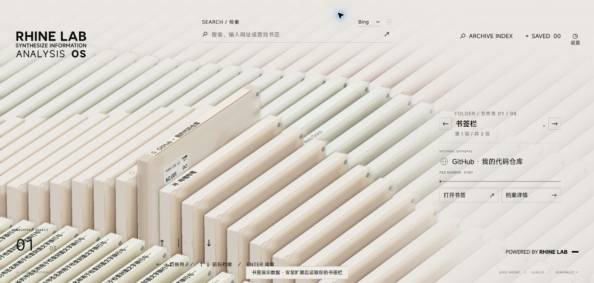
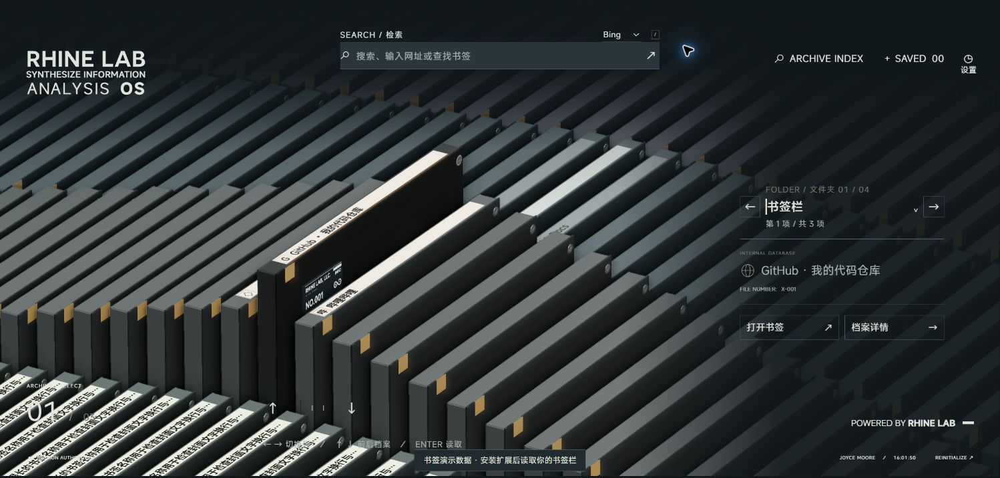

# 0.8.0 阅读与清晰度验证

2026-09-21。仅实现用户同意的阅读、导航、搜索图标、功能字号与清晰度调整，沿用原生 Three.js / DOM。没有新增悬停提示，没有改变 GLB、阵列间距、右侧书签名称布局或按钮优先级。

## 实现

- 书脊标记按连续轨道坐标保留附近一个周期，边界对称淡入淡出，避免快速拖动时重复名称突变。归位副本沿用相同透明度；玻璃档案仍保持无限阵列。
- 仅交互书签预览增加 6° 俯角，详情镜头端点不变，模型尺寸和选中抬高 0.6 不变。选中细线位于书脊贴图底部 95–100%，文本和 Logo 区域止于 89%，归位副本及独立查看器移除此线。
- 文件夹原生选择器直接跳转并保留各列记忆，显示本列位置/数量；选择器键盘输入不传给三维导航。搜索和档案索引复用本地图标缓存，仅可见结果行请求图标，滚动后补充。
- 清晰画质沿用原始材质、阴影、AO，DPR 上限由 1.5 提至 3，关闭景深。首次仅迁移旧默认值；保留手动配置及超级性能覆盖。界面采用原生 zoom 和最小物理字号，书脊继续独立全分辨率渲染。屏幕 DPR 改变时重新适配。

## 自动检查

- `npm run build:extension`：TypeScript、Vite、发行包/CSP/本地资源检查通过，版本 0.8.0，33.9 MiB，821 个文件。
- `npm run check:extension`：20 项通过，包含循环透明度边界、画质一次迁移、显示缩放下的缓冲尺寸、书签安全打开、图标候选重试、预热时序及原有书签映射。
- `npm run check:viewport`：通过。
- `npm run build`：普通网页构建和 PWA 生成通过。Vite 仍有原有的大 chunk 提示，不是运行时错误。

## Chrome 实际页面检查

检查对象是最终 `release/extension` 的 HTTP 演示页，使用与扩展相同的 CSP，只有样例书签，未读取个人书签。不能替代已安装扩展的真实 favicon 接口及其他电脑验收。

- 常规窗口 1498×718，浏览器报告 DPR 1.710000038。清晰档实际主缓冲/书脊缓冲为 2561×1227，屏幕目标 2561×1228（布局取整差 1px）。原始档为 2246×1077，验证了低 DPR 上限造成的差异。
- 手动改成原始，刷新并打开设置仍为原始，再选清晰后恢复对应尺寸；未发生重复强制迁移。
- 文件夹根部 3 项、学习 2 项、空文件夹 0 项、很多书签 45 项：直达切列、数量、第二项选档和切列记忆正常。
- 搜索“资料”显示五个带图标画布的结果；索引含全部 50 个书签及空列占位。搜索行、模态框未出现横向溢出。
- 1366×768 布局检查；双击当前三维档案成功进入详情，原生 zoom 后鼠标命中仍对齐。
- 900×700 设置面板可滚动，内容宽度与可用宽度同为 749，无横向溢出。
- 明暗两种配色实看：细线位于文字下方，未覆盖字形。最终页面控制台 warn/error 为空。

截图内网站首字/地球是 HTTP 演示无 favicon 接口时的占位，不代表已完成真实 Logo 验收。

## 待用户验收

请更新扩展并新建标签页，检查真实书签的顶部阅读面积和选中边线是否合适；这一轮没有加宽实体书脊。请在曾报告模糊的电脑上查看设置中的实际渲染/屏幕目标，并对比清晰档；尚未在该电脑复现，不能确认模糊全部由分辨率造成。更高像素密度可能增加 GPU 开销，原有性能档和自定义仍可选。小尺寸缓存 Logo 的原始细节上限仍存在。

---

## 历史验证记录（0.5.0）

2026-09-16，针对用户第 3–6 项反馈，仅改书签扩展交互阶段；保留原官网、模型资产与竖直抽取/归位规则。

- 文件夹导航移入右侧信息组，位于 INTERNAL DATABASE 之上，放大文件夹名并加同列色标。信息组向右收窄，隐藏重复分类/权限文字；搜索栏上移居中并加宽。
- 各文件夹列按顺序使用低饱和颜色，玻璃输出轻微着色；选中、阵列、归位副本和独立模型使用一致的类别颜色。
- 书签名称直接保留浏览器 title，包括空字符串、空格、中文和看起来像网址的自定义名称。空名称不再补成域名。书签变化仍通过既有「刷新书签」提示更新，不擅自重播导航页。
- 主场景新增独立 WebGL 文字层，按实际屏幕像素密度绘制顶部标签，避开主场景低分辨率与景深。真实模型几何只写入深度，随后画标签，保留相互遮挡；背景标签保留远雾和上方淡出，选中标签不受雾色影响。图标保持原色。图集按窄条比例打包，增加每个书签可用像素。
- 新文字层在开场准备时完成编译/上传；释放三维资源时一起销毁。此方案增加一次深度/文字绘制及独立显存开销，不能视为零成本性能优化。
- 桌面预览镜头将物体投影放大约 25%，选中区域重新置于左下；详情平滑恢复原有比例。无模型横移或修改抽取轨迹。搜索区的上方留白与右侧信息区遮罩分别处理。

## 验证

- 35 项内容、书签映射、导航、循环、动作与预热回归通过；新增原始名称与空名称保留检查。
- 扩展构建、扩展权限/CSP 检查、普通网页构建通过。
- Chrome 对实际扩展构建的 HTTP 演示页检查了明暗主题、文件夹切换、详情进出、低画质及显示开关。性能画质主场景为 1198×574，独立标签层仍为 2561×1227；原始画质主场景为 2246×1077。没有用提高主场景画质冒充文字独立清晰。
- 480×900 窄屏检查：搜索区域约 y=92–172，文件夹/书签区域约 y=504–695，不重叠；退出时恢复默认视口、亮色和原始画质。
- 本轮浏览器控制台无新增错误/警告。真实扩展 favicon 接口仍不能在 HTTP 演示中验证，首字占位不作为真实 Logo 成功的证据；源图本身只有 16/32px 时不能凭空增加细节。

视觉方向仍由用户验收；独立 360° 查看器继续采用自身画质管线，本轮独立清晰层针对起始页阵列及主场景详情。

## 0.8.1 用户修订：移除文件夹下拉

用户明确只保留左右切换，因此删除原生 select、下拉小箭头、覆盖容器及其事件/CSS；文件夹名称和当前项/总数保留。此前 0.8.0 的 selectOption 检查没有证明鼠标能打开下拉，不能作为该入口鼠标可用的依据。

0.8.1 扩展构建、CSP/资源检查和 20 项扩展测试通过。Chrome 对最终发行包的演示页实际点击左右按钮：书签栏（1/3）→学习（1/2）→书签栏（1/3）；名称、数量与选档同步，界面不再包含下拉入口。真实浏览器书签仍由用户更新扩展后验收。
